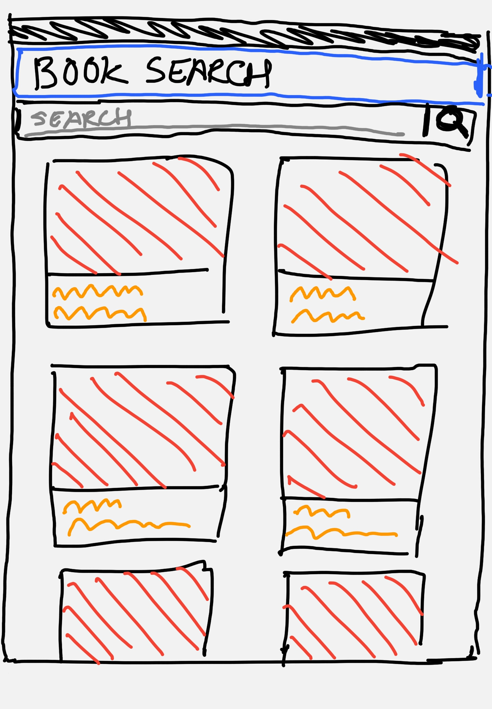
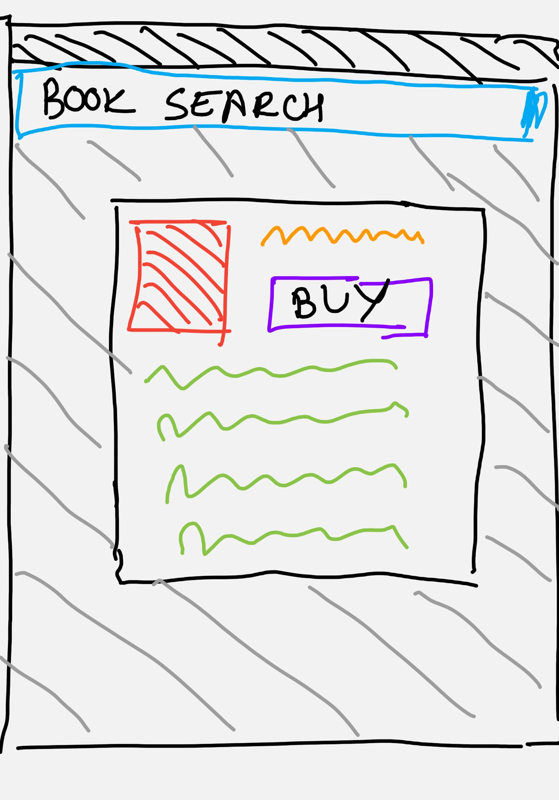
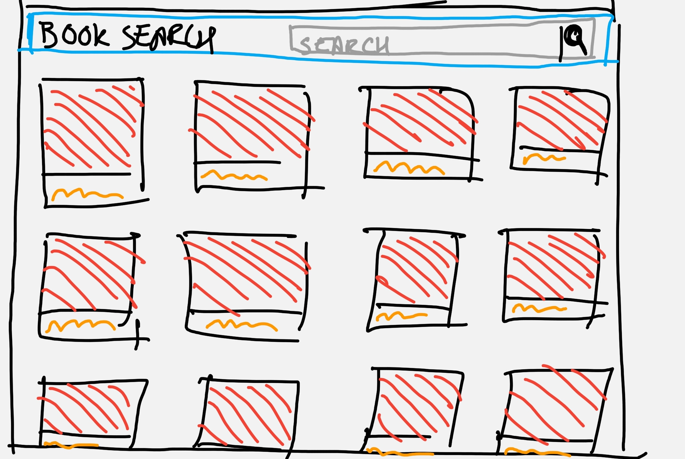
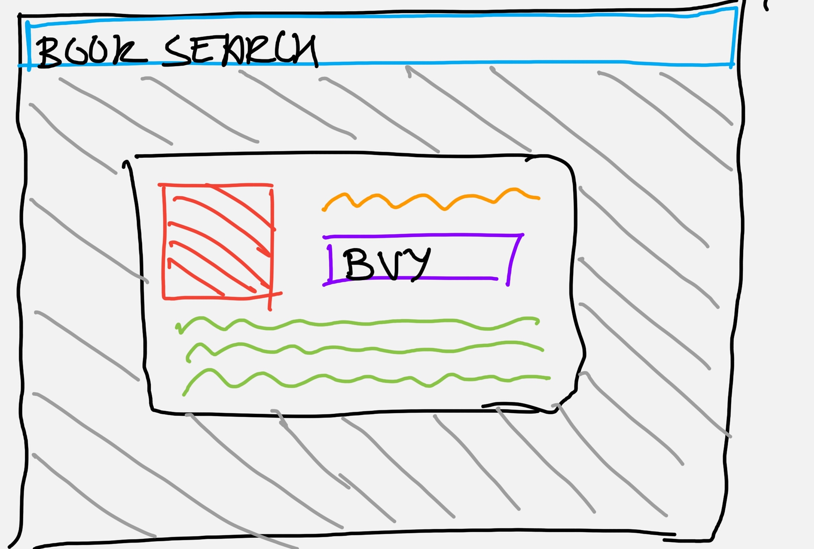

# Thinkful Capstone Project
## User Flow
* User is welcomed with a search bar.
* User enters the name of the book or author they are looking for.
* The site queries the APIs and shows the books with the cover image and author name.
* The User can click on the book to get more description in a details screen.
* The User can view the book on Google books if they want to purchase it.
## Prototype Design
### Mobile devices

#### Main Page

#### Detail Page
### Desktop devices

#### Main Page

#### Detail Page
